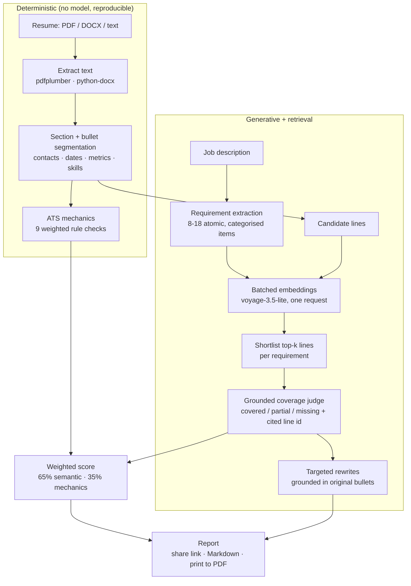

# FitScope

**Resume ↔ job-description fit intelligence. Every score cites the resume line behind it.**

[](https://github.com/shahriar-ahmed-seam/fitscope/actions/workflows/ci.yml)


Paste a resume and a job posting. FitScope decomposes the posting into screenable
requirements, retrieves the resume lines that speak to each one, and grades the match with
the evidence shown next to it — then scores document mechanics separately.

| | Live |
| --- | --- |
| API | https://fitscope-api-xmdy.onrender.com |
| Interactive docs | https://fitscope-api-xmdy.onrender.com/docs |
| Scoring weights | https://fitscope-api-xmdy.onrender.com/api/v1/scoring |
| Web app | _pending Vercel deploy_ |

> The API runs on Render's free tier and sleeps when idle, so the first request after a
> quiet period pays a cold start.

---

## Why it is built this way

Most resume scanners return a single number with nothing behind it. Two design decisions
fix that:

**1. Two scores, not one.** *Semantic fit* answers "is this person qualified for this
posting?". *ATS readiness* answers "does this document survive a parser and a 20-second
skim?". They are computed by completely separate machinery — one generative, one
rule-based — because a beautifully formatted resume for the wrong job and a perfect
résumé in an unreadable PDF are different problems with different fixes.

**2. No label without a citation.** Coverage decisions are made by a model that may only
cite line ids it was handed by the retriever. It cannot reference a bullet that does not
exist, so every "covered" in the report has a quotable line under it.

## Pipeline



Every external dependency has a fallback, so the service degrades instead of failing:

| Stage | Primary | Fallback when unavailable or throttled |
| --- | --- | --- |
| Requirement extraction | DeepSeek, JSON mode | Regex section/bullet extractor |
| Retrieval | Voyage embeddings (single batched call) | IDF-weighted lexical recall |
| Coverage decision | Grounded LLM judge, one call for all requirements | Similarity thresholds, or the Voyage reranker when enabled |
| Rewrites | DeepSeek | Deterministic rule-based hints |
| Persistence | Neon Postgres + pgvector | Stateless mode: analysis still returns, no share link |

### The rate-limit constraint, and why the reranker is opt-in

A cross-encoder reranker per requirement would be the textbook choice for stage 3. It
costs one provider request per requirement, and an unpaid Voyage key allows **3 requests
per minute** — a single analysis with 15 requirements would need five minutes.

So the shipped design spends its embedding budget on *one* batched request (all
requirements plus all resume lines together) and moves the decision to a single grounded
LLM call, which is flat in cost regardless of requirement count. Requests are shaped by a
process-wide token bucket that gives up quickly and falls back rather than stacking
retries. Set `VOYAGE_RERANK_ENABLED=true` on a key with real throughput and the reranker
path activates; `GET /health` reports which decider is live, and every report records the
one that produced it.

## Measured against human labels

Twelve resume × job pairs (3 resumes × 4 postings, including a deliberate out-of-field
posting) were each labelled 0-100 by hand **before any model output was inspected**, then
scored by the live pipeline.

| Metric | Full pipeline | Deterministic only |
| --- | --- | --- |
| Pearson *r*, semantic fit vs human | **0.996** | 0.955 |
| Spearman *ρ*, semantic fit vs human | **0.959** | 0.950 |
| Pairwise ranking accuracy (65 comparisons) | **89.2%** | 81.5% |
| Top-1 posting match per resume | **3/3** | 3/3 |
| Median latency per analysis | 6.2 s | 44 ms |
| p95 latency per analysis | 12.1 s | 55 ms |

```bash
cd backend
python -m eval.run_eval            # full pipeline
python -m eval.run_eval --no-llm   # deterministic, no network, no keys
```

Twelve pairs is a small set: read these as a sanity check that ordering and absolute
calibration are sane, not as a benchmark. CI runs the deterministic mode on every push and
fails if Spearman drops below 0.85 or pairwise accuracy below 0.75.

## Scoring, in the open

`GET /api/v1/scoring` returns the live weights. Nothing is hidden:

- **Overall readiness** = 65% semantic fit + 35% ATS readiness.
- **Requirement weights**: must-have ×3, responsibility ×1.5, nice-to-have ×1.
- **Coverage values**: covered 1.0, partial 0.5, missing 0.
- **ATS mechanics** (100 points): machine-readable text 12, contact block 10, standard
  headings 12, dated history 8, quantified achievements 16, action verbs 10, bullet
  length 8, role keyword coverage 18, formatting hygiene 6.

## API

Interactive docs at `/docs`, OpenAPI at `/openapi.json`.

| Method | Path | Purpose |
| --- | --- | --- |
| `POST` | `/api/v1/analyze` | Analyse pasted resume text against a job description |
| `POST` | `/api/v1/analyze/upload` | Same, with a PDF/DOCX/TXT upload (multipart) |
| `POST` | `/api/v1/parse` | Structure a resume without scoring it |
| `GET` | `/api/v1/reports` | Recent public reports |
| `GET` | `/api/v1/reports/{id}` | Fetch a stored report |
| `GET` | `/api/v1/reports/{id}/markdown` | Markdown export |
| `GET` | `/api/v1/reports/{id}/similar` | Nearest previously analysed postings (pgvector) |
| `GET` | `/api/v1/scoring` | Live weights and thresholds |
| `GET` | `/api/v1/quota` | Remaining free runs for the caller |
| `GET` | `/api/v1/metrics` | Provider usage, tokens, latency percentiles |
| `GET` | `/health` | Liveness, no I/O — safe for platform health checks |
| `GET` | `/readyz` | Readiness: confirms the database actually answers |

`/health` performs no I/O on purpose. Pointing a platform health check at an endpoint
that queries a serverless database means a cold start looks like an outage, the instance
gets pulled from rotation, and traffic sees intermittent `no-server` 404s — which is
exactly what happened on the first deploy of this service.

```bash
curl -X POST https://YOUR-API/api/v1/analyze \
  -H 'Content-Type: application/json' \
  -d '{"resume_text": "...", "job_description": "...", "fast_mode": true}'
```

### Security posture

The demo endpoints are **unauthenticated on purpose** — one click, no sign-up — so they
are protected by an IP-scoped daily cap (`RATE_LIMIT_PER_DAY`, default 25) backed by
Postgres, with an in-process fallback. Send a key from `API_KEYS` in `X-API-Key` to bypass
the cap. Identical prompts are served from a cache, so repeat analyses of the same pair
cost nothing. If you fork this and point it at your own keys, keep the cap on: these
routes spend tokens.

Uploaded files are parsed in memory and discarded. Only the resulting analysis is stored,
and only when a database is configured. Report links are unguessable ids, not
enumerable integers, and are excluded from search indexing.

## Run it locally

Requires Python 3.10+ and Node 20+.

```bash
# 1. API
cd backend
python -m venv .venv && .venv/Scripts/activate      # Linux/macOS: source .venv/bin/activate
pip install -r requirements.txt
cp .env.example .env                                # fill in what you have; all keys optional
python run_dev.py                                   # http://127.0.0.1:8000

# 2. Web app (second terminal)
cd frontend
npm install
cp .env.local.example .env.local                    # point at the API port
npm run dev                                         # http://localhost:3000
```

It works with **zero API keys** — you get regex requirement extraction, lexical retrieval
and threshold-based coverage. Add `DEEPSEEK_API_KEY` for the judge and rewrites,
`VOYAGE_API_KEY` for embeddings, `DATABASE_URL` for shareable reports.

On Windows use `python run_dev.py` rather than `uvicorn` directly: psycopg's async mode
needs the selector event loop, which `run_dev.py` installs before the loop is created.

## Deploy

**API → Render.** `render.yaml` is a complete blueprint: Docker runtime, free plan,
`/health` as the health check, `rootDir: backend`, auto-deploy on push to `main`. Secrets
are declared `sync: false`, so set these in the dashboard (or via the API):

```
DEEPSEEK_API_KEY   VOYAGE_API_KEY   DATABASE_URL   PUBLIC_BASE_URL   ALLOWED_ORIGINS
```

`ALLOWED_ORIGINS` must include your frontend origin (`*.vercel.app` is additionally
allowed by regex). `PUBLIC_BASE_URL` is the frontend base used to build share links.

**Database → Neon.** Create a project and paste the connection string. The API creates its
own schema, including the `vector` extension, on first boot. Pooled connections are
health-checked and retired early because Neon suspends idle compute and drops connections.

**Web app → Vercel.**

```bash
cd frontend
vercel link                                            # root directory: frontend
vercel env add NEXT_PUBLIC_API_BASE_URL production      # https://your-api.onrender.com
vercel --prod
```

Then point the API back at the deployed frontend so share links resolve:

```
PUBLIC_BASE_URL=https://your-app.vercel.app
ALLOWED_ORIGINS=https://your-app.vercel.app
```

## Repository layout

```
backend/
  app/
    main.py              FastAPI app, CORS, timing middleware
    config.py            settings, scoring weights, provider limits
    db.py                Neon pool, schema, provider cache, usage log
    ratelimit.py         IP-scoped daily quota
    schemas.py           request/response contracts
    routers/             analyze · reports · meta
    services/
      textkit.py         normalisation, sectioning, bullet + metric detection
      parsing.py         PDF/DOCX ingestion
      skills.py          skill ontology (150+ canonical skills with aliases)
      jd.py              requirement extraction (LLM + regex fallback)
      retrieval.py       Voyage client, token bucket, lexical fallback
      judge.py           grounded coverage judging
      matching.py        shortlist → decide → weighted score
      ats.py             nine deterministic mechanics checks
      suggest.py         grounded rewrites
      report.py          Markdown rendering
      pipeline.py        orchestration + persistence
  eval/
    fixtures/            3 resumes, 4 postings, 12 hand-labelled pairs
    run_eval.py          correlation + ranking + latency harness
    smoke_api.py         end-to-end check against a running server
frontend/
  app/                   landing · /r/[id] shared report · /how-it-works
  components/            analyzer · report · site chrome · primitives
  lib/                   API client, types mirroring the backend, formatting
```

## Known limits

- Scanned or image-only PDFs cannot be read. Real ATS parsers fail on them too, which the
  report says explicitly rather than silently scoring zero.
- Judgements reflect what the resume *states*. A skill you have but never wrote down reads
  as missing — that is the finding, not a bug.
- No employer's actual ATS is queried. The mechanics score models common parser and
  screener behaviour, not one specific vendor.
- Rewrites never invent numbers; they insert `[X%]`-style placeholders for you to fill.

## Credits

Hero photography by [Daniil Komov](https://www.pexels.com/photo/modern-laptop-on-wooden-desk-with-code-displayed-34803994/)
and [Sora Shimazaki](https://www.pexels.com/photo/professional-man-interviewing-an-applicant-5668863/) on Pexels.

Built by [Shahriar Ahmed Seam](https://github.com/shahriar-ahmed-seam). MIT licensed.
